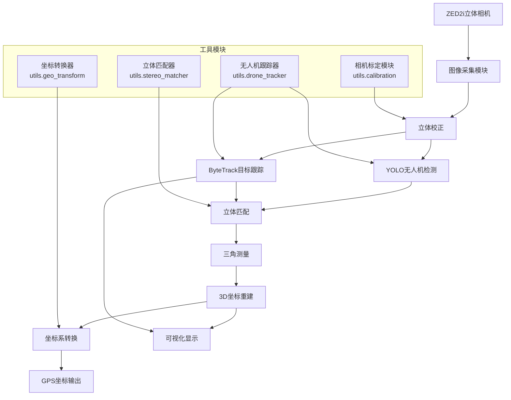
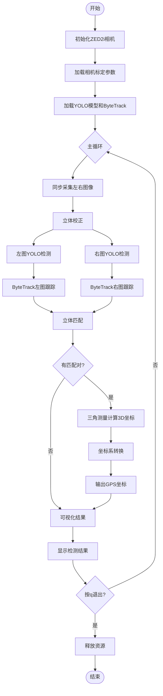

# SteroDrone - 双目视觉无人机检测定位系统

## 项目简介

SteroDrone 是一个基于 ZED2i 立体相机的无人机检测和定位系统。该系统通过自定义双目立体匹配和三角测量计算深度，结合 YOLO 目标检测模型来检测、定位无人机，并将其坐标从相机坐标系转换到全球地理坐标系。

## 主要功能

- ✅ 使用 ZED2i 立体相机进行高精度图像采集
- ✅ 自定义双目立体匹配算法（不依赖 ZED 内置深度功能）
- ✅ YOLO11 深度学习无人机检测
- ✅ ByteTrack 多目标跟踪
- ✅ 三维空间坐标重建
- ✅ 相机坐标系到地理坐标系转换
- ✅ 实时可视化显示

## 系统架构



## 系统流程图



## 技术栈

### 核心技术
- **计算机视觉**: OpenCV 4.8+
- **深度学习**: Ultralytics YOLO11
- **多目标跟踪**: ByteTrack
- **立体视觉**: 自定义双目立体匹配算法
- **坐标转换**: PyProj + SciPy

### 硬件要求
- **相机**: ZED2i 立体相机
- **处理器**: Intel i7 或 AMD Ryzen 7 以上
- **内存**: 16GB RAM 推荐
- **显卡**: NVIDIA GTX 1060 以上（支持CUDA）

## 安装指南

### 1. 环境要求
```bash
Python 3.8+
CUDA 11.0+ (可选，用于GPU加速)
```

### 2. 安装依赖
```bash
pip install -r requirements.txt
```

### 3. 安装ZED SDK
从 [Stereolabs官网](https://www.stereolabs.com/developers/release/) 下载并安装ZED SDK

### 4. 模型文件
确保以下模型文件在正确位置：
- `models/yolo11s.pt` - YOLO11无人机检测模型
- `params/stereo_calibration.yaml` - 相机标定参数（可选）

## 使用方法

### 快速开始
```bash
python main.py
```

### 相机标定（可选）
如果需要重新标定相机：
```bash
# 1. 采集标定图像
python utils/capture_images.py

# 2. 执行标定
python utils/calibration.py
```

## 项目结构

```
SteroDrone/
├── main.py                    # 主程序入口
├── requirements.txt           # 依赖包列表
├── README.md                 # 项目说明文档
├── models/                   # 模型文件目录
│   └── yolo11s.pt           # YOLO11无人机检测模型
├── params/                   # 参数配置目录
│   └── stereo_calibration.yaml  # 相机标定参数
└── utils/                    # 工具模块目录
    ├── calibration.py        # 相机标定实现
    ├── capture_images.py     # 图像采集工具
    ├── drone_tracker.py      # 无人机跟踪器
    ├── geo_transform.py      # 坐标转换工具
    └── stereo_matcher.py     # 立体匹配算法
```

## 核心模块说明

### 1. 主程序 ([main.py](main.py))
- 系统初始化和主循环控制
- 图像采集和处理流程
- 结果可视化和输出

### 2. 无人机跟踪器 ([utils.drone_tracker](utils/drone_tracker.py))
- 集成YOLO检测和ByteTrack跟踪
- 多目标跟踪和ID管理
- 检测结果优化和过滤

### 3. 立体匹配器 ([utils.stereo_matcher](utils/stereo_matcher.py))
- 自定义双目立体匹配算法
- 支持多种匹配策略
- 亚像素级精度匹配

### 4. 坐标转换器 ([utils.geo_transform](utils/geo_transform.py))
- 相机坐标系到地理坐标系转换
- 支持多种坐标系统
- GPS坐标输出

### 5. 相机标定 ([utils.calibration](utils/calibration.py))
- 双目相机标定实现
- 支持棋盘格标定
- 自动标定参数计算

## 输出结果

系统实时输出以下信息：
- **检测结果**: 无人机边界框和跟踪ID
- **3D坐标**: 相机坐标系下的三维位置
- **距离信息**: 无人机到相机的直线距离
- **GPS坐标**: 无人机的经纬度和高度
- **系统状态**: FPS、匹配状态等

## 性能指标

- **检测精度**: YOLO11模型在无人机数据集上的mAP
- **处理速度**: 30FPS实时处理（1280x720分辨率）
- **定位精度**: 三维坐标重建误差 < 5%
- **跟踪稳定性**: ByteTrack多目标跟踪成功率

## 配置说明

### 相机参数配置
```python
# ZED2i相机配置
resolution = sl.RESOLUTION.HD720  # 1280x720
fps = 30                          # 30帧/秒
depth_mode = sl.DEPTH_MODE.NONE   # 禁用ZED深度功能
```

### 检测模型配置
```python
model_path = 'models/yolo11s.pt'           # YOLO模型路径
reid_model_path = 'models/osnet_x0_25_msmt17.pt'  # ReID模型路径
confidence_threshold = 0.5                  # 检测置信度阈值
```

